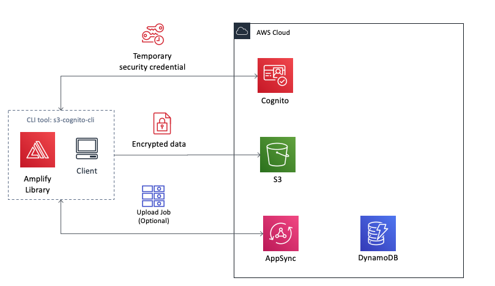

# s3-cognito-cli

### This is a simple reference architecture and demo/example to enable external users managed by Cognito User pool to access an internal S3 bucket. 
### The upload logic uses S3 multiUpload feature.



* index.js => entry point
* configer.js => set the local configuration
* uploader.js => s3 upload logic
* saveUploadJob method in uploader => an additional example to save the upload object's meta data through AWS AppSync. Check 3 about the option.

## 1. Creating S3 Bucket and Cognito User Pool with amplify cli
### Generate configuration and resources
* Option 1: Use AWS Amplify CLI [AMPLIFY](AMPLIFY) to create resources
* Option 2: Use AWS Management Console to create resources

## 2. Quick Start
### 2-1. Installation - only once
```
$ npm install -g s3-cognito-cli
```

### 2-2. Profile Configuration - which S3 Bucket, which Cognito Userpool to use - only once for one S3 & Cognito environment. <aws-exports.json> is created in Step 1.
**One time job, you only need to save a config once.**
```
$ s3cognito config --set <aws-exports.json> --usr <user> --pwd <pwd>
```

### 2-3. SignUp a Cognito Userpool User - only once if only using this user
**One time job, you only need to sign up once for a certain user.**
```
$ s3cognito signup --usr <user> --pwd <pass> --email <email_address>
```

### 2-4. Confirm SignUp - only once for this user
**One time job, you only need to confirm once.**
```
$ s3cognito confirm --usr <user> --code <confirmation_code>
```

### 2-5. Upload your file
**After the previous steps you are able to upload different files as many times as you want with this upload command.**
**Under the hood the program will first sign in through Cognito User Pool with the Amplify library and then multi-upload the local file to the prepared S3 bucket.**
```
$ s3cognito upload <your_file_relative_path>
```

## 3. Save upload task and object meta data(Optional)
**To save the original file name and the owner of the upload task it is recommended to keep a record.**
**This saveUploadJob method uses AppSync as a facade of a DynamoDB table.**
```
const saveUploadJob = async ({objKey, fileKey, fileName, user}) => {
	const API = Amplify.API;
	const graphqlOperation = Amplify.graphqlOperation;

	const input = {
	    user,
	    objKey,
	    fileKey,
	    fileName,
	    status: 'Done',
	    uploadedOn: new Date().toISOString()
	};

    const rtn = await API.graphql(graphqlOperation(createUploadJob, { input }))
      .catch(e => {
        throw e;
      });

  	return { fileKey, data: rtn };
}
```

**It will create a record in DynamoDB with the following information:**

* user: user name of the upload job's owner
* objKey: the key of the uploaded file as an object on s3 including full path
* fileKey: the s3 object's key without the full path
* fileName: original file name
* status: upload status
* uploadedOn: job's timestamp

```
const createUploadJob = `mutation CreateUploadJob($input: CreateUploadJob!) {
  createUploadJob(input: $input) {
    user
    objKey
    fileKey
    fileName
    status
    uploadedOn
  }
}
`;
```

**This repository does not include the steps to create the AppSync API and the DynamoDB table.**
**Please find this following official tutorial as reference.**
[AppSync Tutorial: DynamoDB Resolvers ](https://docs.aws.amazon.com/appsync/latest/devguide/tutorial-dynamodb-resolvers.html)