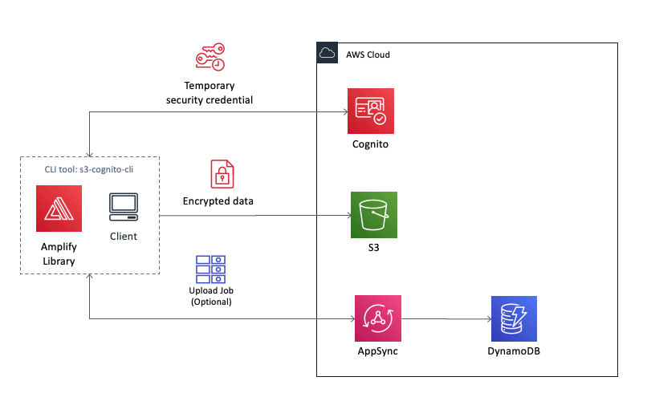

# s3-cognito-cli

### This is a simple reference architecture and demo/example to enable external users managed by Cognito User pool to access an internal S3 bucket. 
### The upload logic uses S3 multiUpload feature.



* index.js => entry point
* configer.js => set the local configuration
* uploader.js => s3 upload logic
* saveUploadJob method in uploader => an additional example to save the upload object's meta data through AWS AppSync.

## 1. Creating S3 Bucket and Cognito User Pool with amplify cli
### Generate configuration and resources
* Option 1: Use AWS Amplify CLI [AMPLIFY](AMPLIFY) to create resources
* Option 2: Use AWS Management Console to create resources

## 2. Quick Start
### 2-1. Installation - only once
```
$ npm install -g s3-cognito-cli
```

### 2-2. Profile Configuration - which S3 Bucket, which Cognito Userpool to use - only once for one S3 & Cognito environment. <aws-exports.json> is created in Step 1.
```
$ s3cognito config --set <aws-exports.json> --usr <user> --pwd <pwd>
```

### 2-3. SignUp a Cognito Userpool User - only once if only using this user
```
$ s3cognito signup --usr <user> --pwd <pass> --email <email_address>
```

### 2-4. Confirm SignUp - only once for this user
```
$ s3cognito confirm --usr <user> --code <confirmation_code>
```

### 2-5. Upload your file
```
$ s3cognito upload <your_file_relative_path>
```
